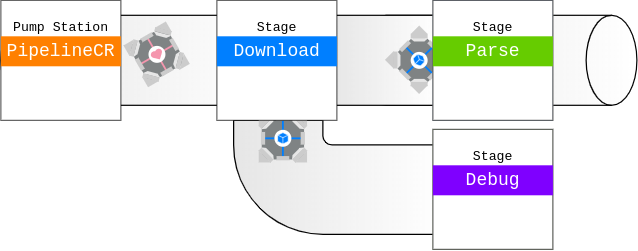

# PipelineCR

 

[](https://BlobCodes.gitlab.io/pipelinecr) [](https://gitlab.com/BlobCodes/pipelinecr/pipelines) [](https://gitlab.com/BlobCodes/pipelinecr/-/releases/0.3.0)

Pipelines are a simple way to efficiently parallelize workloads consisting of multiple asynchronous subtasks.

## Installation

1. Add the dependency to your `shard.yml`:
   
   ```yaml
   dependencies:
     pipelinecr:
       gitlab: blobcodes/pipelinecr
   ```

2. Run `shards install`

## Prequisites

To use the library, you first need to include it.

```crystal
require "pipelinecr"
```

##  Stages

Stages are basically the workers that process your packages.
You can use the following template to create a stage: 

```crystal
class MyStage < PipelineCR::Stage(InputType, OutputType)
  def initialize()
    # Here you can define important instance-variables
    # If you do not need it, just remove it
  end

  def task(pkg : InputType) : OutputType? | Enumerable(OutputType)?
    # Here you do the actual work
    # You process the package and return it when it's processed
    # You can also return an array of OutputType, which will automatically be split to achieve greater parallelism
    # Please remove one of the return types of the method if you only need one.
  end

  def on_error(pkg : InputType, ex : Exception)
    # Here you can handle errors that emerged while handling a package
    # If you want to use the standard behaviour (print the exception, throw away the package),
    # you can remove the method entirely
  end

  def on_close
    # Here you can perform actions when the pipeline is not needed anymore.
    # For example you could close connections to servers or files.
  end
end
```

In the stage, you have a few helper methods: 

- `loopback(pkg : InputType)`, `loopback(pkgs : Enumerable(InputType))`
  With these methods, you can send the package/s to the beginning of the stage.
  When you loopback multiple packages, the packages are distributed across the parallel stages (if you have any).
  This is helpful when working recursively or when you want to handle errors.
- `skip` (Only in task() method)
  Skips the current package.

##  Packages

Packages are instances of the types your Stages are processing. 

When processing packages in stages, you can return multiple packages, which are then split up automatically.

When choosing the package type, there is only one restriction: It can't be Nil, as it is used to check if a Channel has been closed.

##  Processors

A processor is a wrapper around multiple stages, each connected via the same channel. You can create it by multiplying a Stage class (ex. `pro = MyStage*4`).

Using processors instead of stages can significantly improve the performance when using multithreading or when dealing with blocking tasks (ex. HTTP, Files, User input), as multiple packages can be processed in parallel.
Please notice however, that increasing the worker amount is not a silver bullet. Using hundreds of HTTP clients in parallel or crunching numbers in more workers than you got threads won't improve your performance.

##  Pipelines

A pipeline is a wrapper around multiple stages, processors and sub-pipelines. It has exactly one input and one output channel.
While creating it, a block is used to configure the pipeline.
Example:

```crystal
pipeline = PipelineCR::Pipeline(InputType, OutputType).build do |pipe|
  pipe >>= FirstStage*4
  pipe >>= SecondStage*1 if ACTIVATE_SECOND_STAGE
  pipe >>= PipelineCR.multiply do |pipe|
    pipe >>= ThirdStage*2
    pipe &= PipelineCR.sequence do |pipe|
      pipe >>= FourthStage*1
      pipe >>= FifthStage*1
    end
  end
  pipe >>= PipelineCR.seperate do |pipe|
    pipe |= {SixthStage*2, ->(pkg : PkgType){pkg.success?}}
    pipe >>= FallbackStage*1
  end
end
```

In the example, you can already see the possibilities of the pipeline.

If you want sequential execution (do step 1, then do step 2, etc), you can just use the `pipe >>= (stage : PipelineCR::Pipeable)` method. It attaches a part to the pipeline.

If you want to seperate the pipeline, you can use the `PipelineCR.seperate` method. To seperate the packages, you need to use the `pipe.|=(Tuple(PipelineCR::Pipeable, Proc(InputType, Bool)))` method, which takes a Stage as well as a proc returning a boolean whether to accept the given package or not. The seperator then sends the package to the **first** Stage, if any, that accepts it. The outputs of all stages are combined afterwards. You can use as many stages with conditions as you want as well as one optional fallback stage without a condition using the default `pipe.>>=(stage)` method. 

If you want to send the packages to multiple paths inside the pipeline, you can use the `PipelineCR.multiply` method. It sends the package to every stage it is given. The outputs of all stages are, again, combined afterwards.

Inside the `PipelineCR.multiply` and `PipelineCR.seperate` methods, you can use the `PipelineCR.sequence` method to create a sequential subtask inside those multiple-entry methods.

Inside the  `PipelineCR.multiply` method, you can also use the `pipe &= (stage : PipelineCR::Pipeable)` method, which receives packages, but does not send anything. Before using the `&=(other)` method however, you must have used the `>>=(other)` method at least once because of type safety.

## Using Pipelines

After the pipeline was created, you can process packages with it.
Example:

```crystal
pipeline.on_receive do |pkg|
  puts pkg
end
# OR
receiver = Array(OutputType).new
pipeline.receiver = receiver

pipeline << ["package1", "package2", "package3"]
pipeline << "package4"

pipeline.finish
pipeline.close
```

There are basically three steps involved when using pipelines: 

- Setting up the receiver

- Sending packages

- Finishing

To set up the receiver, you can either use the `on_receive` method to define a custom action or pass an array to the `receiver=` method, which will collect all responses from the pipeline and append them to the array.

To send the packages to the pipeline, you can use the `Pipeline.<<(pkg : InputType)` or `Pipeline.<<(pkgs : Array(InputType))` methods.

At the end, you can wait for all packages to be processed using the `pipeline.finish` method.

When you do not need the pipeline anymore, do not forget to close the pipeline. Not doing so allows you to still send packages to the pipeline, but uses unnecessary ram when not used anymore.

## Contributing

1. Fork it (<https://gitlab.com/blobcodes/pipelinecr/fork>)
2. Create your feature branch (`git checkout -b my-new-feature`)
3. Commit your changes (`git commit -am 'Add some feature'`)
4. Push to the branch (`git push origin my-new-feature`)
5. Create a new Pull Request

## Contributors

- [BlobCodes](https://github.com/blobcodes) - creator and maintainer
